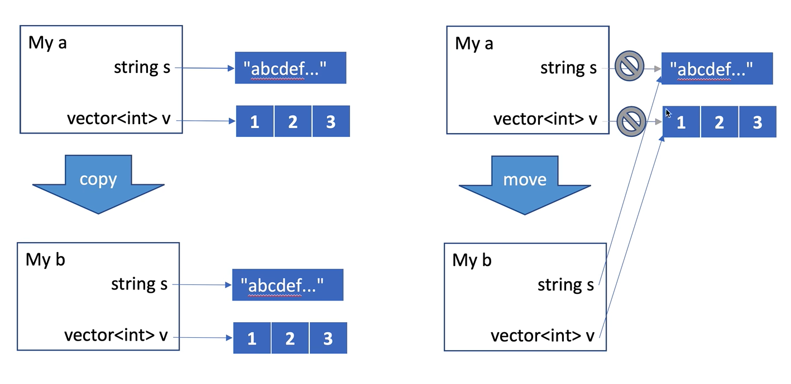

---
category:
  - Cpp STL
tag:
  - Cpp
---

# std::move

### 左值和右值
  
  1. 左值: 赋值表达式结束后仍然存在的持久对象
  2. 右值: 赋值表达式用完即丢的临时对象
   
```cpp
    int n;
    n = 1; // 这里n是左值，1是右值，n在赋值完还会继续存在，但是1就会消失
    1 = n; // 这里就是一个错误的语法，值从右传递到左，1在分配后就会被移除
```

<br>

> 划重点: std::move就是一个右值引用

### move的原理

比如说我这里有一个class My，它的组成是这样的
```cpp
class My {
    std::string s;
    std::vector<int> v;
}
```

如果我分配了两个My类的instance分别为a和b，当我进行 `b = std::move(a)` 操作时候，实际的情况如下图所示



这个图可以说是一目了然了。move直接让b指向了a的内容，同时也将a的内容全都如同右值那样直接舍弃和移除。  

外显的效果就是将a中的所有内容都迁移到了b当中  

这不同于普通的copy，在copy完之后a还是有内容的，b只是保留得到了一个a的副本。

**但是**，需要提一点的是，在`std::move`当中还有一些特性...  
比如Small String Optimization(短字符串优化)，它会在你实际move之前先判断你要move的string长不长。如果长，那么我们就跟上面讲的一样，进行这种迁移，a本身的内容不会存在了；但如果这个string很短，我们就会直接对其进行拷贝。  
(再扯一点，这也是为什么短字符串在stack中，而长字符串在heap上)

### move的优点
  
  最后来聊聊move有什么让我们不得不去用它的理由  

   1. 减少不必要的数据复制，使得性能开销一定程度的减小，从而达到提高性能的作用
   
~~emmm可能我就只能列出这一项吧~~